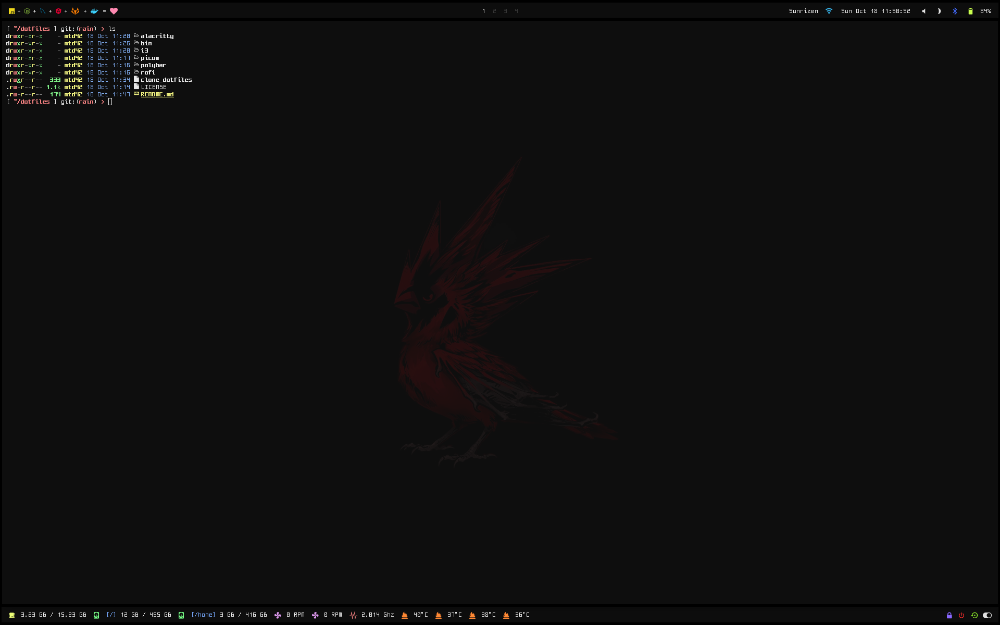

## Environment

Window manager `i3-gaps`

Terminal `alacritty`

Compositor `picom`

Editor `vim`

Application manager `rofi`

Status bar `polybar`

Default shell `bash`

Operating system `archlinux`

### Screenshot

## Author

 `mtd42`
